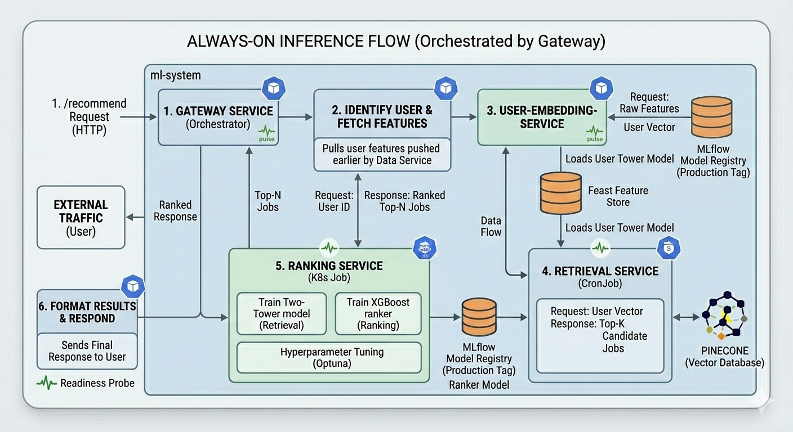
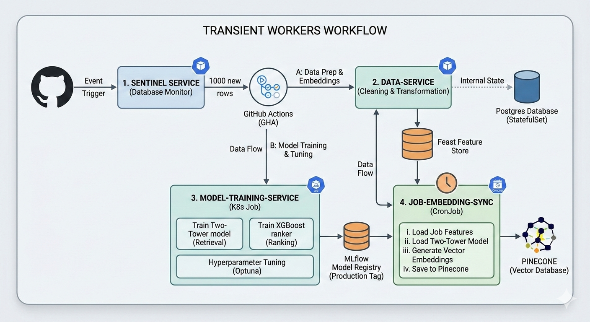

# production-Grade 2-Stage Recommender System

**A Self-Evolving, Distributed ML Platform on Kubernetes**

## Overview

This repository contains a full-stack, production-ready  2-stage recommendation engine. Moving beyond simple notebooks, this project implements a **7-service microservice architecture** that handles everything from real-time inference to automated continuous training (CT).

### Key Highlights:

* **Two-Stage Retrieval:** Candidate generation (Two-Tower) followed by precise ranking (XGBoost).
* **Infrastructure-as-Code:** Fully containerized with Kubernetes (Deployments, Jobs, CronJobs).
* **Automated MLOps:** A "Sentinel" service triggers retraining based on data drift/volume.
* **Production Observability:** Integrated monitoring with Prometheus, Grafana, and Jaeger.


## System Architecture

The system is divided into two logical groups:

### 1. The Always-On Backbone (Inference)

[]

The live request path optimized for low latency and high availability.

* **Gateway Service:** The entry point and orchestrator.
* **User-Embedding Service:** Converts raw user features into high-dimensional vectors.
* **Retrieval Service:** Queries **Pinecone** for Top-K job candidates.
* **Ranking Service:** Re-scores candidates for the final Top-N recommendation.

### 2. The Transient Workers (Pipeline)

[]

Ephemeral services that manage the lifecycle of data and models.

* **Data Service:** Cleans and pushes features to the **Feast Feature Store**.
* **Model-Training Job:** K8s Jobs for distributed training and hyperparameter tuning (Optuna).
* **Job-Embedding CronJob:** Synchronizes the vector database with new job postings.


## Tech Stack

| Category | Tools |
| --- | --- |
| **Orchestration** | Kubernetes (EKS/GKE), Helm |
| **ML Frameworks** | PyTorch (Two-Tower), XGBoost (Ranking), Optuna |
| **Data & Features** | Feast (Feature Store), PostgreSQL, Pinecone (Vector DB) |
| **MLOps** | MLflow (Model Registry), GitHub Actions (CI/CD/CT) |
| **Observability** | Prometheus, Grafana, Jaeger (Tracing) |

---

## The MLOps Loop (CI/CT/CD)

This project implements a "Closed-Loop" automation strategy:

1. **CI:** Path-based Docker builds via GitHub Actions.
2. **CT:** The **Sentinel Service** monitors Postgres; once a ~1k row threshold is met, it triggers a K8s Training Job.
3. **CD:** Automated "Production" tagging in MLflow and rolling updates in K8s ensure zero-downtime model swaps.

---

## Getting Started

### Prerequisites

* Kubernetes Cluster (Minikube/Kind for local)
* Python 3.9+

### Installation

1. **Clone the Repo:**
```bash
git clone https://github.com/your-username/recommender-system.git

```


2. **Deploy Infrastructure:**
```bash
helm install ml-infra ./charts/infrastructure

```


3. **Deploy Services:**
```bash
kubectl apply -f ./k8s/manifests/

```


## Monitoring & Tracing

Access the dashboards to view system health:

* **Grafana:** `http://localhost:3000` (Inference Latency & Error Rates)
* **Jaeger:** `http://localhost:16686` (Distributed Tracing across the 7 services)


## Lessons Learned

* **Environment Portability:** Shifted from hardcoded `localhost` to runtime injection via **ConfigMaps** and **Secrets**.
* **Cold Start Mitigation:** Implemented **Readiness Probes** to ensure models are fully loaded from MLflow before pods accept traffic.
* **Decoupling:** Using a Feature Store (Feast) allowed the Training and Inference services to share a "Single Source of Truth."


